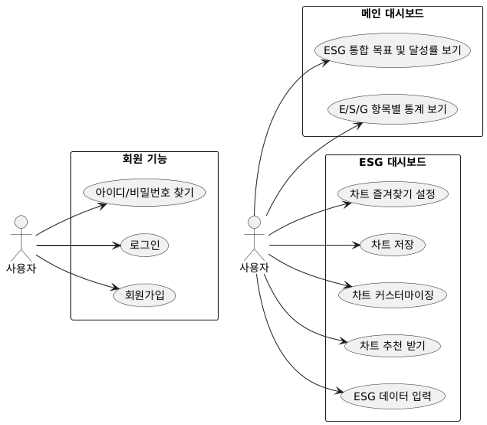
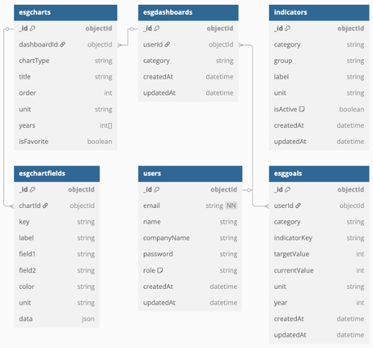
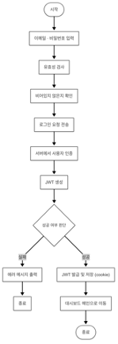
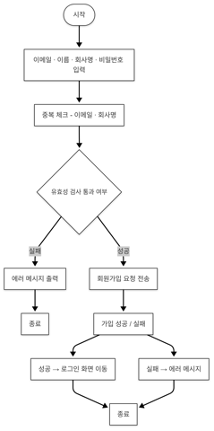

# 📊 NNMM - ESG 분석 및 통합 대시보드

> **Next.js, NestJS, MongoDB 기반의 ESG(환경·사회·지배구조) 데이터 시각화 플랫폼**

---

## 🧩 프로젝트 개요

* **프로젝트명**: NNMM (Next.js + NestJS + MongoDB + Mongoose)
* **개발 기간**: 2025.03.24 \~ 2025.04.07
* **팀 구성 및 역할**:

  * 김동환: 총괄 팀장
  * 김지현: Backend, Frontend
  * 정상진: Backend, Frontend

---

## ✨ 프로젝트 소개

**NNMM**은 기업의 ESG 데이터를 디지털화하고 시각적으로 통합 관리할 수 있는 플랫폼입니다.
사용자는 환경(E), 사회(S), 지배구조(G) 영역의 데이터를 직접 입력하고, 이를 기반으로 **맞춤형 대시보드**, **목표 지표 설정**, **자동 차트 생성** 등의 기능을 활용할 수 있습니다.

* ✅ **ESG 경영 활동을 정량화하여 데이터 기반 의사결정 지원**
* ✅ **MongoDB 기반의 유연한 스키마로 확장성 확보**
* ✅ **Next.js 기반 SSR과 반응형 UI로 높은 접근성 제공**

---

## 🎯 개발 목적

* ESG 정보의 **중앙화 및 디지털화**
* 정량 데이터를 통한 **지속가능경영 지원**
* **자동 차트 추천**을 통한 인사이트 강화
* **변경 이력 추적**으로 투명성 및 신뢰도 확보

---

## 🔧 주요 기능

| 기능 구분         | 설명                              |
| ------------- | ------------------------------- |
| 📥 ESG 데이터 입력 | 환경, 사회, 지배구조 영역별 입력 폼           |
| 📊 대시보드       | Chart.js, Recharts 기반 맞춤형 차트 생성 |
| 🎯 목표 설정      | 카테고리별 KPI 설정 및 진행률 추적           |
| 🕵️ 변경 이력     | 데이터 변경사항 로그 기록                  |
| 🤖 자동 추천      | 입력된 데이터 기반 차트 형태 추천             |

---

## 🛠 기술 스택

| 영역           | 기술                               |
| ------------ | -------------------------------- |
| **Frontend** | Next.js, TypeScript, TailwindCSS |
| **Backend**  | NestJS, TypeScript               |
| **Database** | MongoDB, Mongoose                |
| **시각화**      | Chart.js, Recharts               |
| **인증**       | JWT 기반 인증 시스템                    |

---

## 🧠 시스템 구성도 및 플로우

### ✅ 유스케이스 다이어그램

### ✅ ERD (MongoDB 컬렉션 구조)

### ✅ 로그인 플로우 (JWT 기반 인증)

### ✅ 회원가입 플로우

### ✅ ESG 데이터 입력 → 차트 생성 흐름

### ✅ 지표 목표 설정 프로세스

### ✅ 차트 수정/삭제 플로우

---

## 💡 기대 효과

* 📈 ESG 경영 효율화 및 체계적인 데이터 관리
* 🔍 실시간 데이터 기반 의사결정 지원
* 🧩 사용자 친화적인 UI로 비개발자도 손쉽게 사용 가능
* 🔒 신뢰성과 투명성을 기반으로 한 지속가능경영 실현

---

